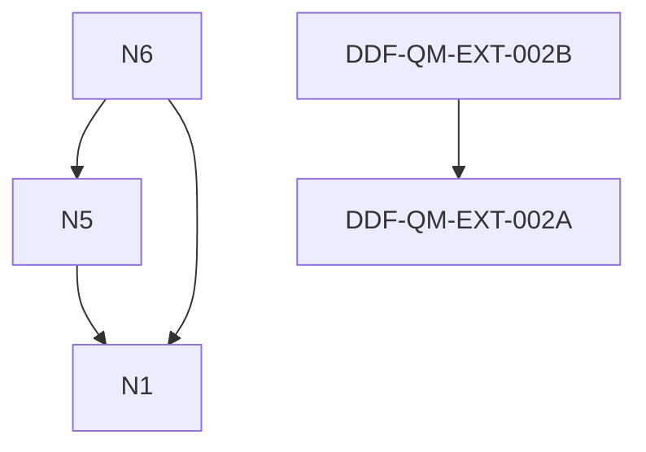

# Dependency Graph

path: 00_index/dependency-graph.md
folder: 00_index
filename: dependency-graph.md
repository: DDF
type: research_note

# Dependency Graph

## 01 Foundations — Dependency Graph.md
- no dependencies

## 01 Foundations — Derivation Chain.md
- no dependencies

## 01 Foundations — Notes Index.md
- no dependencies

## 01 Foundations — Reading Order.md
- no dependencies

## 01_foundations — AI Context Index.md
- no dependencies

## 01_foundations — Index.md
- no dependencies

## 01_foundations — Local Framework Map.md
- no dependencies

## F1 — Harmonic Projection.md
- no dependencies

## F2 — Projection Constraints.md
- no dependencies

## F3 — Spectral Selection.md
- no dependencies

## F3a -  Algebraic Structure of the Generative Domain.md
- ⚠ missing → F3 and does not replace it.

## F4 — Particle Discreteness.md
- no dependencies

## F5 — Structural Role of Physical Constants in DDF.md
- no dependencies

## F6 — Fermionic and Bosonic Sectors.md
- no dependencies

## F7 — Gauge Redundancy from Projection.md
- no dependencies

## F8 — Projection Generator.md
- no dependencies

## f8-spectral-sm.md
- no dependencies

## 02 Operator - Dependency Graph .md
- ⚠ missing → --
- ⚠ missing → N10
- ⚠ missing → N8
- ⚠ missing → N2
- ⚠ missing → N3
- ⚠ missing → N9

## 02 Operator - Index.md
- no dependencies

## 02 Operator - Reading Order — Operator Notes.md
- no dependencies

## 02 Operator Chain.md
- no dependencies

## 02 Operator — Notes Index.md
- no dependencies

## Master Derivation Chain (Final).md
- no dependencies

## N0 — Operator Emergence and Hyperbolic Cone.md
- no dependencies

## N0 — Scope, Claims, and Limitations of DDF.md
- no dependencies

## N1
- no dependencies

## N10 — Spectral Action and Emergence of Constants.md
- no dependencies

## N11 — Unified Constraint on Constants from Spectral Geometry.md
- no dependencies

## N12 — First Prediction Relative Scale of G and Gauge Couplings.md
- ⚠ missing → --
- ⚠ missing → operator D details
- ⚠ missing → gives scaling, not exact numbers

## N13 — Explicit Computation of A₂  A₄ from Dirac Operator.md
- ⚠ missing → --
- ⚠ missing → choice of D
- ⚠ missing → representation (Dirac spinor)
- ⚠ missing → :
- ⚠ missing → dimension (4D used)
- ⚠ missing → Additional fields modify coefficient

## N1b — Admissibility ⇒ Hyperbolicity (Microlocal Formulation).md
- no dependencies

## N2 — Lorentz Invariance from Propagation Cone.md
- no dependencies

## N2b — Dispersion and Admissibility.md
- ⚠ missing → --
- ⚠ missing → ✔ may be cone-compatible (locally or band-limited)
- ⚠ missing → Status:
- ⚠ missing → wave packets spread over time
- ⚠ missing → ⚠ requires further admissibility constraints
- ⚠ missing → k
- ⚠ missing → wavevector.

## N3 — Dirac Factorisation from Lorentz Invariance.md
- no dependencies

## N4 — Spin Structure and SU(2) Emergence.md
- no dependencies

## N5 — Gauge Structure from Projection Symmetry Breaking.md
- no dependencies

## N5a — Gauge Algebra Selection from Projection Structure.md
- no dependencies

## N5b — Internal Decomposition (1,2,3) from Projection Generator.md
- no dependencies

## N5c — Fermion Representations from Internal Decomposition.md
- no dependencies

## N5d — Hypercharge U(1) from Internal Decomposition.md
- no dependencies

## N5e — Anomaly Cancellation from Projection Admissibility.md
- no dependencies

## N5f — Minimality as a Consequence of DDF Admissibility.md
- no dependencies

## N5g — Classification of Admissible Fibre Algebras.md
- no dependencies

## N6 — Mass Generation from Projection Constraint Structure.md
- no dependencies

## N7 — Gravity from Projection Curvature Response (Einstein Limit).md
- no dependencies

## N8 — Curvature from Projection Generator L (Corrected).md
- no dependencies

## N9 — Lichnerowicz Identity from Projection Generator L.md
- no dependencies

## DDF Lagrangian.md
- no dependencies

## N — Mass as Spectral Gap (Core Derivation).md
- no dependencies

## N — Mass Derivation (Open Proof Obligations).md
- no dependencies

## n7-actionfunctional.md
- no dependencies

## unified_field_equation.md
- no dependencies

## N-G1
- no dependencies

## N-G2
- no dependencies

## N-G3
- no dependencies

## N-G4  newton_constant_from_spectral_action.md
- no dependencies

## N-G5 Lorentzian-Spectral-Triples-and-Norm-Continuous-Wick-Transformations-in-DDF.md
- no dependencies

## n13-lorentzian-heatkernel.md
- no dependencies

## N‑G2a Lorentzian–Euclidean Spectral Bridge in DDF.md
- no dependencies

## n4-quantisation_rigidity.md
- no dependencies

## S0 — Selberg vs Weil Structural Mapping.md
- no dependencies

## S1 — Selberg Trace Admissibility.md
- no dependencies

## S2 — Selberg Trace Functional Definition.md
- no dependencies

## S3 — Inverse Trace Rigidity (Selberg).md
- no dependencies

## S4 — Admissibility Exclusion Principle.md
- no dependencies

## S5 — DDF Interpretation of Selberg Rigidity.md
- no dependencies

## S6 — Research Programme and Open Problems.md
- no dependencies

## Selberg Trace — Master Index.md
- no dependencies

## N5
- ⚠ missing → --
- depends on → N1

## N6
- ⚠ missing → --
- ⚠ missing → N1b — Admissibility ⇒ Hyperbolicity
- depends on → N5
- ⚠ missing → N2
- depends on → N1

## QM-EXT-001_projection_degeneracy.md
- no dependencies

## QM-EXT-002_entanglement_from_projection_fibres.md
- no dependencies

## DDF-QM-EXT-002A
- ⚠ missing → DDF-QM-EXT-002
- ⚠ missing → 01_foundations F1–F4
- ⚠ missing → 02_operator_notes (Dirac factorisation, spin)

## DDF-QM-EXT-002B
- ⚠ missing → DDF-QM-EXT-002
- depends on → DDF-QM-EXT-002A

## DDF-QM-EXT-003
- ⚠ missing → DDF-QM-EXT-001 (Projection Degeneracy)
- ⚠ missing → DDF-QM-EXT-002 (Multi-Projection Entanglement)

## QM-EXT-003_toy_model_projection_fibres.md
- no dependencies

## QM-EXT-004
- ⚠ missing → DDF-QM-EXT-002
- ⚠ missing → N8
- ⚠ missing → dirac_factorisation
- ⚠ missing → 04-propagation_rigidity

## qm-ext-005-operatoralgebras.md
- no dependencies

## riemann_operator.md
- no dependencies

## Spectral Number Theory Interface for DDF.md
- ⚠ missing → --

## numeric-projectionnorms-fit.md
- no dependencies

## DDF — Paper 1.1.md
- no dependencies

## DDF — Paper 2.md
- no dependencies

## DDF — Paper 3.5.md
- ⚠ missing → No physical laws or constants are derived in this paper.
- ⚠ missing → the current observable state.
- ⚠ missing → L_\psi
- ⚠ missing → the current observable state ( \psi ).
- ⚠ missing → ]
- ⚠ missing → [
- ⚠ missing → representing the realised action of (L) under state-dependent constraints.
- ⚠ missing → -----
- ⚠ missing → We denote this as:

## DDF — Paper 3.md
- ⚠ missing → the domain and metric in which their variables are defined.
- ⚠ missing → -----

## DDF — Paper 4.md
- ⚠ missing → However:
- ⚠ missing → feedback influences admissible states and solutions
- ⚠ missing → ( \psi )
- ⚠ missing → the operator (L^\dagger L) remains well-defined
- ⚠ missing → -----

## Paper 1 DDF Conceptual Foundations and Framing.md
- no dependencies

## Working Note Projection Push-Back Model (Balloon Analogy).md
- ⚠ missing → > the source does not change — the **environment changes how it appears**
- ⚠ missing → system moves toward balance
- ⚠ missing → So:
- ⚠ missing → 2. **Self-regulation**
- ⚠ missing → the current state of (U)
- ⚠ missing → its own state
- ⚠ missing → 4. **Emergent variation**
- ⚠ missing → 3. **Single origin**
- ⚠ missing → differences arise from response, not multiple sources
- ⚠ missing → -----
- ⚠ missing → the solution must satisfy both simultaneously.
- ⚠ missing → all behaviour comes from one source
- ⚠ missing → the state,
- ⚠ missing → the state is determined by the operator,
- ⚠ missing → observed behaviour = result of their combination

## Working note2  G-light, projection push-back, and DDPM v2.md
- no dependencies

---

## Visual Graph

