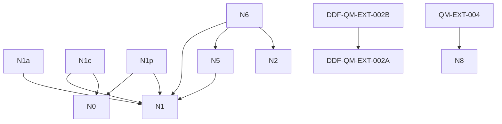

# Dependency Graph

## 01-foundations-AI-Context-Index.md
- no dependencies

## 01-Foundations-Dependency-Graph.md
- no dependencies

## 01-Foundations-Derivation-Chain.md
- no dependencies

## 01-foundations-Index.md
- no dependencies

## 01-foundations-Local-Framework-Map.md
- no dependencies

## 01-Foundations-Notes-Index.md
- no dependencies

## 01-Foundations-Reading-Order.md
- no dependencies

## F1
- no dependencies

## F2
- no dependencies

## F3
- no dependencies

## F3a
- ⚠ missing → F3 and does not replace it.

## F4
- no dependencies

## F5
- no dependencies

## F6
- no dependencies

## F7
- no dependencies

## F8
- no dependencies

## N1a
- depends on → N1
- ⚠ missing → Harmonic compression principle (U as admissible spectrum)
- ⚠ missing → Lorentz rigidity (cone-preserving symmetry)
- ⚠ missing → Spectral admissibility / trace-admissibility framework
- ⚠ missing → --

## 02-operator-chain.md
- no dependencies

## Admissibility and Spectral Transitions.md
- no dependencies

## Admissibility Balance Equation (Corrected Form).md
- no dependencies

## N0
- no dependencies

## N0a
- no dependencies

## N1
- no dependencies

## N10
- no dependencies

## N11
- no dependencies

## N12
- ⚠ missing → operator D details
- ⚠ missing → gives scaling, not exact numbers
- ⚠ missing → --

## N13
- ⚠ missing → choice of D
- ⚠ missing → representation (Dirac spinor)
- ⚠ missing → dimension (4D used)
- ⚠ missing → Additional fields modify coefficient
- ⚠ missing → :
- ⚠ missing → --

## N1b
- no dependencies

## N1c
- ⚠ missing → N1b — Admissibility and Hyperbolicity, Microlocal Formulation
- ⚠ missing → F5 — Structural Role of Physical Constants
- depends on → N1
- ⚠ missing → F1 — Harmonic Projection
- ⚠ missing → F2 — Projection Constraints
- ⚠ missing → --
- ⚠ missing → N1p — Phase / Dispersion Interpretation
- depends on → N0
- ⚠ missing → F8 — Projection Generator

## N1d
- no dependencies

## N1p
- depends on → N0
- ⚠ missing → --
- ⚠ missing → F5 — Structural Role of Physical Constants
- depends on → N1

## N2
- no dependencies

## N2b
- ⚠ missing → may be cone-compatible locally or approximately;
- ⚠ missing → Nonlinear dispersion generally requires at least one of:
- ⚠ missing → higher-order derivatives;
- ⚠ missing → may be admissible as an effective or emergent correction;
- ⚠ missing → Status:
- ⚠ missing → broken Lorentz covariance;
- ⚠ missing → \(k\);
- ⚠ missing → is not globally admissible as a fundamental irreducible scalar dispersion law.
- ⚠ missing → preferred frame or scale;
- ⚠ missing → effective medium behaviour;
- ⚠ missing → extra internal degrees of freedom;
- ⚠ missing → wave packets spread;
- ⚠ missing → Reason:
- ⚠ missing → band-limited validity.
- ⚠ missing → --
- ⚠ missing → high-frequency behaviour can violate global cone structure unless band-limited;

## N2c
- no dependencies

## N2d
- no dependencies

## N3
- no dependencies

## N4
- no dependencies

## N5
- ⚠ missing → --
- depends on → N1

## N5a
- no dependencies

## N5b
- no dependencies

## N5c
- no dependencies

## N5d
- no dependencies

## N5e
- no dependencies

## N5f
- no dependencies

## N5g
- no dependencies

## N6
- ⚠ missing → N1b — Admissibility ⇒ Hyperbolicity
- depends on → N1
- depends on → N5
- depends on → N2
- ⚠ missing → --

## N7
- no dependencies

## N8
- no dependencies

## N9
- no dependencies

## Transition Law and Admissible Mode Selection (Golden Rule in DDF).md
- no dependencies

## G4
- no dependencies

## G1
- no dependencies

## G2
- no dependencies

## G3
- no dependencies

## G5
- no dependencies

## G6
- no dependencies

## G7
- no dependencies

## Selberg-Trace-Master-Index.md
- no dependencies

## N20
- no dependencies

## N21
- no dependencies

## N21a
- no dependencies

## N22
- no dependencies

## N23
- no dependencies

## N-G1
- no dependencies

## NG13
- no dependencies

## N-G2
- no dependencies

## NG2a
- no dependencies

## N-G3
- no dependencies

## NG4
- no dependencies

## NG5
- no dependencies

## Q01
- no dependencies

## Q02
- no dependencies

## DDF-QM-EXT-002A
- ⚠ missing → 02_operator_notes (Dirac factorisation, spin)
- ⚠ missing → QM-EXT-002
- ⚠ missing → 01_foundations F1–F4

## DDF-QM-EXT-002B
- depends on → DDF-QM-EXT-002A
- ⚠ missing → QM-EXT-002

## DDF-QM-EXT-003
- ⚠ missing → QM-EXT-002
- ⚠ missing → QM-EXT-001

## Q03
- no dependencies

## QM-EXT-004
- ⚠ missing → QM-EXT-002
- ⚠ missing → 04-propagation_rigidity
- ⚠ missing → dirac_factorisation
- depends on → N8

## Q05
- no dependencies

## Q06
- no dependencies

## Arithmetic Transition Intensity (Golden Rule for Primes).md
- no dependencies

## DDF Arithmetic Operator L_arith.md
- no dependencies

## Spectral Admissibility and Prime Emergence.md
- no dependencies

## T01
- no dependencies

## T02
- ⚠ missing → --

## w1-numeric-projectionnorms-fit.md
- no dependencies

## DDF-P1-Conceptual-Foundations-and-Framing.md
- no dependencies

## DDF-P1.1.md
- no dependencies

## DDF-P2.md
- no dependencies

## DDF-P3.5.md
- ⚠ missing → the current observable state.
- ⚠ missing → L_\psi
- ⚠ missing → -----
- ⚠ missing → representing the realised action of (L) under state-dependent constraints.
- ⚠ missing → [
- ⚠ missing → No physical laws or constants are derived in this paper.
- ⚠ missing → We denote this as:
- ⚠ missing → the current observable state ( \psi ).
- ⚠ missing → ]

## DDF-P3.md
- ⚠ missing → -----
- ⚠ missing → the domain and metric in which their variables are defined.

## DDF-P4.md
- ⚠ missing → the operator (L^\dagger L) remains well-defined
- ⚠ missing → ( \psi )
- ⚠ missing → However:
- ⚠ missing → -----
- ⚠ missing → feedback influences admissible states and solutions

## Working-Note-Projection-Push-Back-Model-Balloon-Analogy.md
- ⚠ missing → > the source does not change — the **environment changes how it appears**
- ⚠ missing → the state,
- ⚠ missing → 3. **Single origin**
- ⚠ missing → differences arise from response, not multiple sources
- ⚠ missing → 4. **Emergent variation**
- ⚠ missing → -----
- ⚠ missing → So:
- ⚠ missing → system moves toward balance
- ⚠ missing → all behaviour comes from one source
- ⚠ missing → its own state
- ⚠ missing → the current state of (U)
- ⚠ missing → the state is determined by the operator,
- ⚠ missing → the solution must satisfy both simultaneously.
- ⚠ missing → observed behaviour = result of their combination
- ⚠ missing → 2. **Self-regulation**

## Working-note2-G-light-projection-push-back-and-DDPM-v2.md
- no dependencies

---

## Visual Graph

